# Домашнее задание №5

## Работа с загрузчиком

1. Попасть в систему без пароля несколькими способами
2. Установить систему с LVM, после чего переименовать VG
3. Добавить модуль в initrd

## Вход без пароля

### Вход с использованием `init=/bin/sh`

- Запускаю VirtuakBox, затем запускаю vagrant

```shell
vagrant up
```

- При появлении меню загрузчика останавливаю дальнейшую загрузку

- Стрелками up/down выбераею пенкт меню grub и нажимаю `e` чтобы отредактировать его
- Добавляю `init=/bin/sh` в конец строки начитающейся с `linux16`

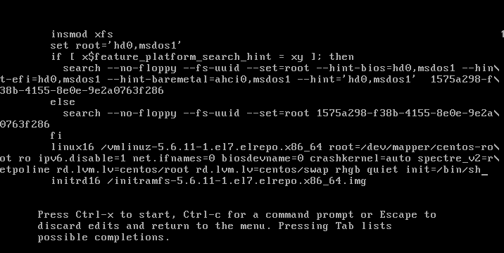

- Нажимаю `ctrl+x` для загрузки с исправленным пунктом меню и загрузчик запускает командную оболочку `sh`

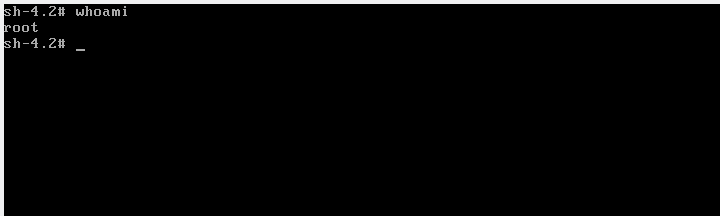

- Перемотирую `rootfs` с доступом на запись

   ```shell
   mount -o remount,rw /
   ```

- Проверяю

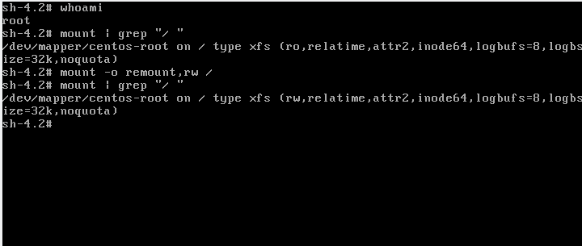

> Здесь я яиспользую запуск `/bin/sh` вместо процесса инициализации по умолчанию, поэтому результатом команды `echo $$` будет `1`, это PID принадлежит процессу `/bin/sh`
> 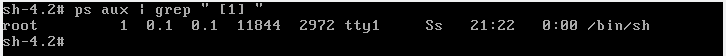
> Этот метод, позволяет сразу получить доступ к корню

### Вход с использованием `rd.break`

- Стрелками up/down выбераею пенкт меню grub и нажимаю `e` чтобы отредактировать его

- Добавляю `rd.break` в конец строки начитающейся с `linux16`

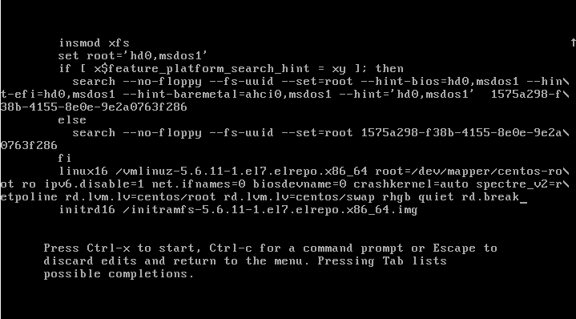

- Нажимаю `ctrl+x` для загрузки с исправленным пунктом меню и загрузчик запускает командную оболочку

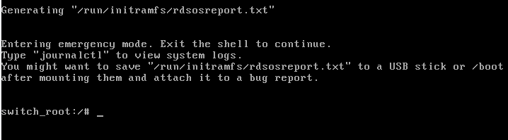

- Теперь корень файловой системы доступен по пути `/sysroot`. Перемонтирую его в режим запись/чтение

   ```shell
   mount -o remount,rw /sysroot
   ```

- Захожу в chroot в `/sysroot`, меняю пароль пользователя `root` и создаю файл `/.autorelable`, чтобы система безопасности selinux перемаркировала файлы

   ```shell
   chroot /sysroot
   passwd root
   touch /.autorelabel
   ```

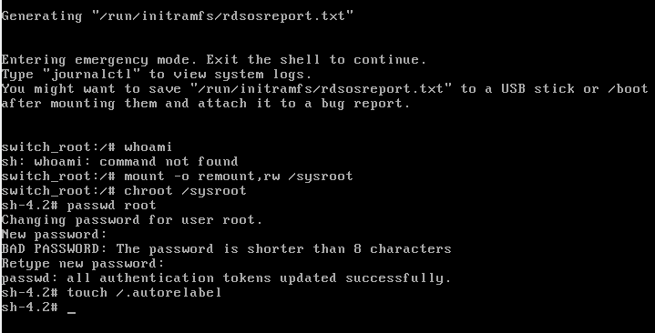

- Выхожу из chroot, перегружаю виртуалку и вхожу как root с ранее изменённым паролем

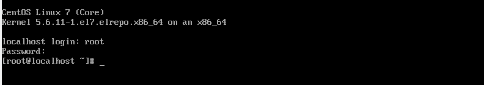

> Этот метод описан в официальной документации как рекомендованный для сброса пароля root без установочного диска. Он просто переводит нас в оболочку в конце выполнения initrd, прежде чем передать управление ядру Linux
> Основное отличие метода с подстановкой параметра занрузки `init=/bin/sh` от метода с подстановкой параметра `rd.break` в том, что во втором случае мы попадаем в среду initrd, а корневая FS монтируется в `/sysroot` каталог.

### rw init sysroot

- Стрелками up/down выбераею пенкт меню grub и нажимаю `e` чтобы отредактировать его

- Заменяю `ro` на `rw` и добавляю параметр `init=/sysroot/bin/sh` в конце строки, начинающейся с `linux16`

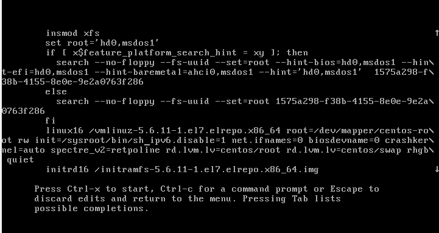

- Нажимаю `ctrl+x` для загрузки с исправленным пунктом меню и загрузчик запускает командную оболочку

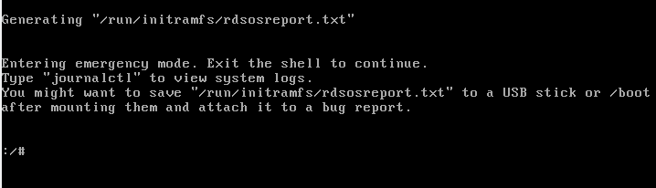

- У нас сразу имеется доступ на запись к `/sysroot`

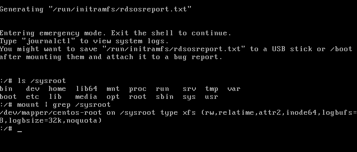

## Переименование root VG

Пересоздам виртуальную машину

```shell
vagrant destroy
vagrant up
vagrant ssh
```

Проверяю текущую конфигурацию

```shell
sudo vgs
```

```log
  VG     #PV #LV #SN Attr   VSize  VFree
  centos   1   2   0 wz--n- <9,00g    0
```

Имя VG `centos`.

По традиции переименовываю его в `OtusRoot`

```shell
sudo vgrename centos OtusRoot
```

```log
  Volume group "centos" successfully renamed to "OtusRoot"
```

Исправляю запись в файле `/etc/fstab`

```shell
sudo sed -i.old 's#^/dev/mapper/centos-#/dev/mapper/OtusRoot-#g' /etc/fstab
cat /etc/fstab
```

```fstab
...
/dev/mapper/OtusRoot-root /                       xfs     defaults        0 0
UUID=1575a298-f38b-4155-8e0e-9e2a0763f286 /boot                   xfs     defaults        0 0
/dev/mapper/OtusRoot-swap swap                    swap    defaults        0 0
```

Поправляю файл накстроек GRUB `/etc/default/grub`

```shell
sudo sed -i.old 's#lvm.lv=centos/#lvm.lv=OtusRoot/#g' /etc/default/grub
cat /etc/default/grub
```

```shell
GRUB_TIMEOUT=5
GRUB_DISTRIBUTOR="$(sed 's, release .*$,,g' /etc/system-release)"
GRUB_DEFAULT=saved
GRUB_DISABLE_SUBMENU=true
GRUB_TERMINAL_OUTPUT="console"
GRUB_CMDLINE_LINUX="ipv6.disable=1 net.ifnames=0 biosdevname=0 crashkernel=auto spectre_v2=retpoline rd.lvm.lv=OtusRoot/root rd.lvm.lv=OtusRoot/swap rhgb quiet"
GRUB_DISABLE_RECOVERY="true"
```

Иcправляю меню загрузки `/boot/grub2/grub.cfg`

```shell
sudo sed -i.old1 's#/dev/mapper/centos-#/dev/mapper/OtusRoot-#g' /boot/grub2/grub.cfg
sudo sed -i.old2 's#lvm.lv=centos/#lvm.lv=OtusRoot/#g' /boot/grub2/grub.cfg
sudo cat /boot/grub2/grub.cfg
```

[Вывод](./screens/vg-renamed-grub.cfg)

Восстанавливаю `initrd` с новым именем VG

```shell
sudo mkinitrd -f -v /boot/initramfs-$(uname -r).img $(uname -r)
```

[Вывод](./screens/mkinitrd.log)

Очередная перезагрузка

```shell
sudo reboot
```

Проверяю результат

```shell
sudo vgs
```

```log
  VG       #PV #LV #SN Attr   VSize  VFree
  OtusRoot   1   2   0 wz--n- <9,00g    0
```

### Запуск с помощью скрипта

Скрипт [rename-vg.sh](./scripts/rename-vg.sh) необходимо применить к вновь созданной виртуальной машине

- Запуск на хостовой машине

```shell
vagrant ssh < scripts/rename-vg.sh 2>&1 | tee ./screens/rename-vg.log

vagrant reload
```

- Убедиться, что VG переименован

```shell
vagrant ssh -c "sudo vgs"
```

```log
  VG       #PV #LV #SN Attr   VSize  VFree
  OtusRoot   1   2   0 wz--n- <9,00g    0 
Connection to 127.0.0.1 closed.
```

The END!

> Примечание. ВМ зависает после rebootили shutdown -r nowв конце сценария. Решается запуском vagrant reloadпосле завершения работы скрипта.

## Добавить модуль в initrd

Пересоздаю виртуальную машину

```shell
vagrant destroy
vagrant up
```

Скрипты модуля должны храниться по адресу `/usr/lib/dracut/modules.d/`.  
Создаю директорю `01test` и скачиваю скрипт `module-setup.sh`

```shell
sudo mkdir -p /usr/lib/dracut/modules.d/01test
curl --silent https://gist.githubusercontent.com/lalbrekht/e51b2580b47bb5a150bd1a002f16ae85/raw/80060b7b300e193c187bbcda4d8fdf0e1c066af9/gistfile1.txt | sudo tee /usr/lib/dracut/modules.d/01test/module-setup.sh
sudo chmod +x /usr/lib/dracut/modules.d/01test/module-setup.sh
```

```shell
#!/bin/bash

check() {
    return 0
}

depends() {
    return 0
}

install() {
    inst_hook cleanup 00 "${moddir}/test.sh"
}
```

Скачиваю скрипт модуля `test.sh`

```shell
curl --silent https://gist.githubusercontent.com/lalbrekht/ac45d7a6c6856baea348e64fac43faf0/raw/69598efd5c603df310097b52019dc979e2cb342d/gistfile1.txt | sudo tee /usr/lib/dracut/modules.d/01test/module-setup.sh
sudo chmod +x /usr/lib/dracut/modules.d/01test/module-setup.sh
```

```shell
#!/bin/bash

exec 0<>/dev/console 1<>/dev/console 2<>/dev/console
cat <<'msgend'

Hello! You are in dracut module!

 ___________________
< I'm dracut module >
 -------------------
   \
    \
        .--.
       |o_o |
       |:_/ |
      //   \ \
     (|     | )
    /'\_   _/`\
    \___)=(___/
msgend
sleep 10
echo " continuing...."
```

Восстанавливаю `initrd`

```shell
# sudo mkinitrd -f -v /boot/initramfs-$(uname -r).img $(uname -r)
# or
sudo dracut -f -v
```

```log
Executing: /sbin/dracut -f -v
```

Убеждаюсь, что модуль установлен

```shell
sudo lsinitrd -m /boot/initramfs-$(uname -r).img | grep test
```

```log
test
```

Удаляю параметры загрузки grub `rghb` и `quiet` из командной строки ядра

```shell
sudo sed -i.old 's/ rhgb quiet//g' /etc/default/grub
sudo grub2-mkconfig -o /boot/grub2/grub.cfg
```

```log
Generating grub configuration file ...
Found linux image: /boot/vmlinuz-5.6.11-1.el7.elrepo.x86_64
Found initrd image: /boot/initramfs-5.6.11-1.el7.elrepo.x86_64.img
Found linux image: /boot/vmlinuz-3.10.0-1127.el7.x86_64
Found initrd image: /boot/initramfs-3.10.0-1127.el7.x86_64.img
Found linux image: /boot/vmlinuz-0-rescue-db529269582b41d89d3f9aed34b3ff97
Found initrd image: /boot/initramfs-0-rescue-db529269582b41d89d3f9aed34b3ff97.img
done
```

Перезагружаюсь и делаю скрин
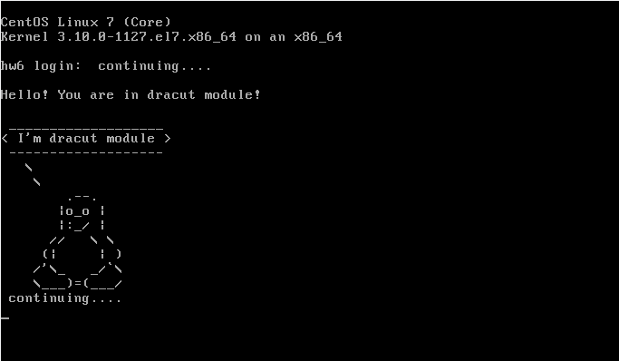
